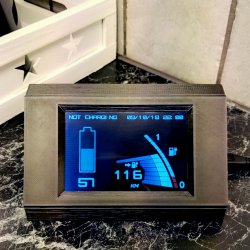
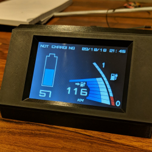
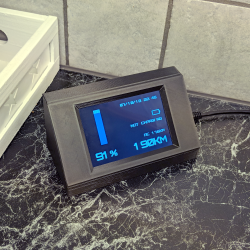
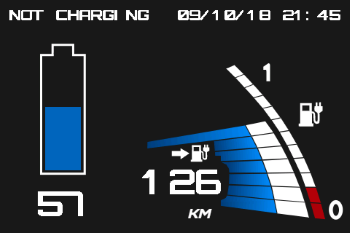

# Nissan Leaf 2017 Dashboard






---

## LeafClient
The LeafClient is a cross platform console application which can authenticate with and query data from Nissan Connect EV.

#### Usage
```
Usage: leafclient username password [-o {filename}] [-last]

Options:
        username        Your Nissan Connect username.
        password        Your blowfish encrypted password.
                        Encrypt your password at http://sladex.org/blowfish.js/.
                        Key: 'uyI5Dj9g8VCOFDnBRUbr3g'. Cipher mode: ECB. Output type: BASE64.

        -o              Outputs the result as JSON to {filename}.
        -last           Don't query live data from car.
```

\* *I intentionally did not add Blowfish encryption to the application because .NET does not have Blowfish encryption integrated in the framework and I did not want to add a dependency. The password needs to be supplied pre encrypted.*

#### Example
`dotnet LeafClient.dll username password -o data.json`

#### Example output file
```json
{
  "TimeStampUtc": "11/10/18 20:35",
  "TimeStamp": "11/10/18 22:35",
  "BatteryCapacity": "240",
  "ChargingStatus": "NOT_CHARGING",
  "SoC": "61",
  "PluginState": "NOT_CONNECTED",
  "Range": "133000",
  "RangeAc": "132000",
  "ChargeTime": "8:30"
}
```

#### Setup/configuration
I use a cron job on a Linux server to periodically run the `LeafClient` console application. I use the `-o` flag which writes the JSON data to a file. This file is served by my web server and consumed by the ESP8266.

---

## IoT parts

### ESP8266 Arduino sketch
The `ESP8266` folder contains an Arduino skecth to retrieve JSON data from a web server and send it to a Nextion display over serial.

### Nextion display
The `Nextion` folder contains the HMI project for the display that shows the data. The Nextion display I used is the `NX4832T035_011` which is the 3.5" version.



*This is the Nextion HMI design. I used the actual Nissan Leaf dashboard as inspiration.*

### Nextion 3D-printable case
STL-files for the Nextion case can be found in the `Nextion Case` folder. The case is designed to be used with one of these [ESP programmers](https://www.ebay.com/itm/ESP-Series-Programmer-for-ESP8285-ESP8266-ESP32-ESP01-adapter-for-arduino/323127795519?hash=item4b3beadf3f:g:AdEAAOSwWmNaoWfZ), which makes it very easy to power and flash the ESP through micro USB. It also provides easy access to power and serial pins for the Nextion display.